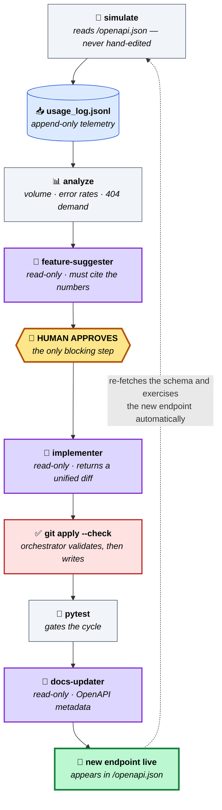

# dev-flywheel

**A FastAPI service that ships its own features, from its own usage data.**

[](https://github.com/rsitaniya/dev-flywheel/actions/workflows/ci.yml)
[](LICENSE)
[](pyproject.toml)

Most "AI writes code" demos stop at generating a diff. The interesting problem is
the rest of the loop: *deciding what to build*, proving it works, and making the
next iteration see what the last one shipped.

dev-flywheel closes that loop. Every request the API serves becomes a line of
telemetry. An analyzer turns that telemetry into signal. An agent proposes features
grounded in that signal — **citing the numbers** — a human approves one, and a
read-only subagent returns a unified diff that the orchestrator validates and
applies. Tests gate the merge. Then the simulator re-reads `/openapi.json`, discovers
the endpoint that was just born, and starts generating traffic against it.

Round and round. The calculator in `app/` is deliberately trivial — **the loop is
the product.**

---

## The loop



<sub>**Purple** = read-only planner subagents (they can only propose) · **Red** = the orchestrator, the only component that writes · **Amber** = you · **Grey** = deterministic tooling</sub>

The dotted line is the part that makes it a flywheel: **nobody edits the simulator
when a feature ships.** It derives every request from the schema at runtime, so a
new endpoint is exercised on the very next cycle.

## Demo

> One full `/dev-loop` cycle: telemetry → proposal → approval → diff → tests → live endpoint.


## Quickstart

```bash
pip install -e ".[dev]"          # or: pip install -r requirements.txt
uvicorn app.main:app --reload    # terminal 1

/dev-loop                        # in Claude Code — one complete cycle
/loop /dev-loop                  # continuous mode
```

`/dev-loop` is one full cycle and stops for your approval exactly once. Run
`python scripts/simulate.py` on its own if you just want to generate signal.

---

## Receipts

These features weren't planned. They were **proposed from the data and shipped by the
loop** — the CHANGELOG records the signal that motivated each one:

| Version | Feature | The signal that caused it |
|---------|---------|---------------------------|
| `0.2.0` | `mod` operation | 2/129 calls returned **HTTP 422 on `op=modulo`** — people asked for an op that didn't exist |
| `0.3.0` | `abs` operation | **82 calls with negative `a`**, 76 with negative `b` |
| `0.5.0` | `safe_divide` | Repeated **`b=0`** traffic taking a hard `400` — clients wanted `null`, not an error |

## Three ideas worth stealing

**1. A 404 is a feature request.**
The usage middleware records requests to paths that *don't exist*. A `GET /sqrt`
returning 404 nine times is the strongest possible signal that someone wants `/sqrt`.
Most telemetry throws these away as noise; here, unmet demand is the highest-quality
input the loop has.

**2. Planners are read-only; the orchestrator is the only writer.**
Every subagent (`feature-suggester`, `implementer`, `docs-updater`) is declared with
read-only tools and returns a **unified diff** as its contract. The orchestrator runs
`git apply --check` before touching the tree. This means no agent can half-write a
file, every handoff is auditable and reviewable, and a malformed patch fails loudly
instead of corrupting the repo. It's the multi-agent write-safety problem solved with
`git` instead of a framework.

**3. The human gate lives in the parent, not the subagent.**
Subagents run headlessly and *cannot* block for input. So the approval step has to sit
in the orchestrating skill — a constraint of the execution model that the design takes
seriously rather than working around.

## How it works

The full mechanism, the subagent handoff contracts, and the design rationale are in
**[SETUP.md](SETUP.md)**. The short version:

| Component | Role |
|---|---|
| `app/main.py` | Example FastAPI app + the ~20-line usage middleware that records everything |
| `scripts/simulate.py` | Walks `/openapi.json`; synthesizes requests from JSON Schema (`$ref`, `enum`, `anyOf`, nested objects) |
| `scripts/analyze_usage.py` | Raw log → signal report (volume, error rates, 404 demand, input distribution) |
| `.claude/agents/` | Read-only planner subagents with strict output contracts |
| `.claude/skills/dev-loop` | The 9-step orchestrator — and the sole writer |
| `flywheel.toml` + `edge_cases.json` | **The only domain-specific files in the repo** |

## Use it on your own API

The loop has no knowledge of the calculator. Point `flywheel.toml` at your FastAPI app,
optionally seed `edge_cases.json`, and run `/dev-loop`:

```toml
[app]
module = "myservice.api:app"
version_files = ["myservice/api.py", "pyproject.toml", "CHANGELOG.md"]
```

Both files degrade gracefully — with **no config and no edge cases at all**, the
simulator still discovers and exercises every endpoint using values synthesized from
your schema alone (CI asserts this on every push). Your app supplies one thing: a
middleware that appends a JSON line per request.

Full guide: **[docs/ADAPTING.md](docs/ADAPTING.md)**.

## Tests

```bash
pytest tests/ -v     # 45 tests, real HTTP round-trips via FastAPI TestClient
ruff check .
```

CI runs lint + tests on Python 3.11/3.12/3.13, and separately boots the API and runs
the simulator against it to prove loop closure hasn't broken.

## License

Apache-2.0 — see [LICENSE](LICENSE).
