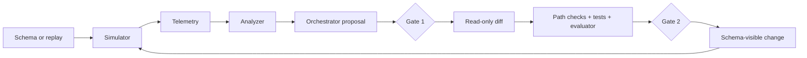

# dev-flywheel

**A controlled delivery loop for turning operational gaps into evaluated changes.**

[](https://github.com/rsitaniya/dev-flywheel/actions/workflows/ci.yml)
[](LICENSE)
[](pyproject.toml)

The reference engagement onboards a new partner data source. The loop reads structured integration failures, proposes a bounded adapter change, runs an evaluator whose gold labels and scorer are protected from the implementer subagent, and requires approval before the tested patch lands.

It is a local benchmark harness, not an autonomous deployment product. The onboarding engagement below is both the primary evidence and the only bundled example.

## Reference engagement: partner-data onboarding

**Problem:** map a new partner’s inconsistent company records into a canonical schema without breaking a source that already works.

**Definition of done:** improve field mapping and normalized-value recall against held-out gold, retain the existing source’s score, and keep the evaluator, gold, fixtures, and core scoring machinery outside the implementer’s write path.


| Metric: new `forbes` source | Baseline | Cycle 1 | Cycle 2 |
|---|---:|---:|---:|
| Schema-mapping F1 | [0.00](engagements/madi_onboarding/runs/forbes/00_baseline.evaluate.json) | [0.55](engagements/madi_onboarding/runs/forbes/01_cycle1.evaluate.json) | [1.00](engagements/madi_onboarding/runs/forbes/02_cycle2.evaluate.json) |
| Value recall | [0.00](engagements/madi_onboarding/runs/forbes/00_baseline.evaluate.json) | [0.375](engagements/madi_onboarding/runs/forbes/01_cycle1.evaluate.json) | [1.00](engagements/madi_onboarding/runs/forbes/02_cycle2.evaluate.json) |
| Fully-correct rate | [0%](engagements/madi_onboarding/runs/forbes/00_baseline.evaluate.json) | [0%](engagements/madi_onboarding/runs/forbes/01_cycle1.evaluate.json) | [100%](engagements/madi_onboarding/runs/forbes/02_cycle2.evaluate.json) |
| Existing `dbpedia` source regressed | — | [No](engagements/madi_onboarding/runs/forbes/01_cycle1.evaluate.json) | [No](engagements/madi_onboarding/runs/forbes/02_cycle2.evaluate.json) |

The artifact trail contains the baseline, ranked gaps, adapter patch, patch hash, and evaluator output for every cycle: [run receipts](engagements/madi_onboarding/runs/MADI_EXAMPLE.md). Read the [case study](engagements/madi_onboarding/CASE_STUDY.md) for the context, decisions, and limits.

## What the system demonstrates

| Delivery concern | Mechanism in this repository |
|---|---|
| Turn observed failure into a scoped engineering decision | Endpoint telemetry and engagement-specific gap analysis rank failed intent and affected records. |
| Work safely with agent-generated changes | The read-only implementer subagent returns a diff; the orchestrator validates protected paths and `git apply --check` (via `apply_patch.py`, the single guarded entry point) before it writes. |
| Measure more than request success | An optional, protected evaluator scores domain correctness and regression against held-out truth. |
| Answer "did it overfit the score, not the problem?" | A real-data test split (MaDI-Bench's own CSVs and gold) is scored once, offline, never during a cycle — a distribution the fitted dev-fixture adapter cannot transfer to. |
| Generalize a one-off solution | The simulator, analyzer contract, controls, and configuration seam are generic; adapters, rules, and each engagement's own analyzer are engagement data. Two configs (dev, real-data test) already select two different datasets and oracles against the same loop. |
| Preserve human accountability | Gate 1 approves scope. Gate 2 approves the exact tested patch. |

## Run it locally

Requires Python 3.11–3.13 and [uv](https://pypi.org/project/uv/) (`pip install uv`). `uv sync`
installs the locked dependency set, including the project itself in editable mode — it is the
CI path and makes the engagement package importable.

```bash
uv sync --all-extras --locked
export FLYWHEEL_CONFIG=engagements/madi_onboarding/flywheel.toml
export USAGE_LOG_PATH=$(uv run python scripts/flywheel_config.py --get app.usage_log)
uv run uvicorn "$(uv run python scripts/flywheel_config.py --get app.module)" --reload
```

In a second terminal, build the replay traffic and inspect the resulting signal:

```bash
uv run python engagements/madi_onboarding/to_replay.py --source forbes
uv run python scripts/simulate.py --run-id local-baseline
uv run python engagements/madi_onboarding/analyze_integration.py "$USAGE_LOG_PATH" --source forbes --run-id local-baseline
```

If you use Claude Code, `/dev-loop` runs one proposed-change cycle with the two approval gates. The complete local procedure is in [SETUP.md](SETUP.md).

## How the loop works



The architectural contracts, control boundaries, test strategy, and non-goals are in [Delivery system architecture](docs/DELIVERY_SYSTEM.md).

## Documentation map

- [Reference engagement](engagements/madi_onboarding/CASE_STUDY.md) — problem, constraints, decisions, outcomes, and limits.
- [Run receipts](engagements/madi_onboarding/runs/MADI_EXAMPLE.md) — raw evidence for the onboarding metrics.
- [Delivery system architecture](docs/DELIVERY_SYSTEM.md) — reusable platform design, contracts, controls, and test strategy.
- [Local runbook](SETUP.md) — install, start, run, and troubleshoot.
- [Adaptation guide](docs/ADAPTING.md) — point the generic loop at another FastAPI API.
- [Security model](SECURITY.md) — threat model, enforced boundaries, and residual risks.
- [Change history](CHANGELOG.md) — append-only release history.
- [Data license notice](engagements/madi_onboarding/DATA_LICENSE_NOTICE.md) — MaDI-Bench data terms and reproducibility boundaries.

## License

Apache-2.0. See [LICENSE](LICENSE) and [NOTICE](NOTICE).
