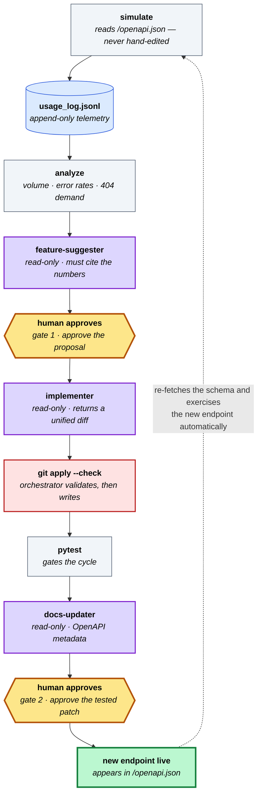

# dev-flywheel

**A FastAPI service that ships its own features, from its own usage data.**

[](https://github.com/rsitaniya/dev-flywheel/actions/workflows/ci.yml)
[](LICENSE)
[](pyproject.toml)

Most "AI writes code" demos stop at generating a diff. The harder problem is the rest
of the loop: deciding what to build, proving it works, and making the next iteration
aware of what the last one shipped.

dev-flywheel closes that loop. Every request the API serves becomes a line of
telemetry. An analyzer turns that telemetry into a signal report. An agent proposes
features grounded in that signal, citing the numbers; a human approves the proposal
(gate 1); a read-only subagent returns a unified diff that the orchestrator validates,
applies, and tests; a human approves the exact tested patch (gate 2) before it is kept.
The simulator then re-reads `/openapi.json`, discovers the new endpoint, and generates
traffic against it — which becomes the next cycle's signal.

The calculator in `app/` is deliberately trivial; the loop is the product.

---

## The loop



<sub>**Purple** = read-only planner subagents (they can only propose) · **Red** = the orchestrator, the only component that writes · **Amber** = you · **Grey** = deterministic tooling</sub>

The dotted line is the part that makes it a flywheel: **nobody edits the simulator
when a feature ships.** It derives every request from the schema at runtime, so a
new endpoint is exercised on the very next cycle.

## Demo

The two ideas that make the loop turn, in 40 seconds — **a 404 becomes a feature
request**, and **the simulator exercises an endpoint that didn't exist when it started**:


Every command is real. The agent turns are narrated rather than played out — a live
`/dev-loop` cycle spends most of its time waiting on model calls and on you, which
makes for a bad GIF. Run `/dev-loop` yourself to see those steps; the diff applied
here is exactly the shape the `implementer` returns.

## Quickstart

```bash
pip install -e ".[dev]"          # or: pip install -r requirements.txt
uvicorn app.main:app --reload    # terminal 1

/dev-loop                        # in Claude Code — one complete cycle
/loop /dev-loop                  # continuous mode
```

`/dev-loop` is one full cycle and stops for your approval exactly once. Run
`python scripts/simulate.py` on its own if you just want to generate signal.

---

## Shipped by the loop

None of these features were planned. Each was proposed from the usage data and shipped
by the loop; the CHANGELOG records the signal that motivated each one:

| Version | Feature | The signal that caused it |
|---------|---------|---------------------------|
| `0.2.0` | `mod` operation | 2/129 calls returned HTTP 422 on `op=modulo` — an op that didn't exist |
| `0.3.0` | `abs` operation | 82 calls with negative `a`, 76 with negative `b` |
| `0.5.0` | `safe_divide` | Repeated `b=0` traffic taking a hard `400` — clients wanted `null`, not an error |

## Design decisions

**A 404 is a feature request.** The usage middleware records requests to paths that
don't exist. A `GET /sqrt` returning 404 nine times is a strong signal that someone
wants `/sqrt`. Most telemetry discards these as noise; here, unmet demand is the
highest-quality input the loop has.

**Planners are read-only; the orchestrator is the only writer.** Every subagent
(`feature-suggester`, `implementer`, `docs-updater`) is declared with read-only tools
and returns a unified diff as its contract. The orchestrator runs `git apply --check`
before touching the tree. No agent can half-write a file, every handoff is auditable,
and a malformed patch fails loudly instead of corrupting the repo — the multi-agent
write-safety problem solved with `git` instead of a framework.

**The human gates live in the parent, not the subagent.** Subagents run headlessly and
cannot block for input, so both approval gates (approve the proposal, then approve the
exact tested patch) sit in the orchestrating skill — a constraint of the execution
model the design follows rather than works around.

## Reference engagement: partner-data onboarding

The calculator proves the loop closes. The [MaDI onboarding engagement](engagements/madi_onboarding/)
proves it makes good decisions, because they are scored against held-out truth.

The same generic loop is pointed (by config alone) at a `POST /ingest` service that
maps and normalizes partner records into a canonical company schema via declarative
per-source adapters. A new source arrives with renamed fields (`sales` where the
target wants `revenue`), string years, `"$1.2B"` money, and country names. Every
record fails; the loop reads the structured gaps, proposes one adapter change per
cycle, and a **held-out evaluator it is forbidden to edit** scores the result
against gold labels ([MaDI-Bench](https://github.com/wbsg-uni-mannheim/MaDI-Bench)).

Real numbers from `evaluate.py`, onboarding a new source across two approved cycles:

| `forbes` metric | Baseline | Cycle 1 | Cycle 2 |
|---|---:|---:|---:|
| schema-mapping F1 | 0.00 | 0.55 | 1.00 |
| fully-correct rate | 0% | 0% | 100% |
| regression on the onboarded source | — | none | none |

Then it reconciles records *across* sources: **entity matching** (F1 0 → 1.00 as
the loop grows fuzzy-match rules) and **data fusion** (accuracy 0.875 → 1.00 as it
learns per-attribute conflict resolution) — again scored against gold, with the
match/fuse engines protected alongside the evaluator.

Two things separate this from a code-only autonomous loop (OpenHands, Forge): it starts
from product signal, not a task prompt; and its metrics cannot be gamed by returning
200 — a plausible-but-wrong mapping (`sales → assets`) is caught by the oracle, and a
patch that tries to edit the evaluator is rejected before it applies. Full write-up:
[CASE_STUDY.md](engagements/madi_onboarding/CASE_STUDY.md).

## How it works

The full mechanism, the subagent handoff contracts, and the design rationale are in
**[SETUP.md](SETUP.md)**. The short version:

| Component | Role |
|---|---|
| `app/main.py` | Example FastAPI app + the ~20-line usage middleware that records everything |
| `scripts/simulate.py` | Walks `/openapi.json`; synthesizes requests from JSON Schema — path & query params (incl. `$ref` and path-level), `enum`, `anyOf`/`oneOf`, merged `allOf`, arrays, nested objects, JSON bodies |
| `scripts/analyze_usage.py` | Raw log → signal report (volume, error rates, 404 demand, input distribution) |
| `.claude/agents/` | Read-only planner subagents with strict output contracts |
| `.claude/skills/dev-loop` | The 9-step orchestrator — and the sole writer |
| `flywheel.toml` + `edge_cases.json` | **The only domain-specific files in the repo** |

## Use it on your own API

The loop has no knowledge of the calculator. Point `flywheel.toml` at your FastAPI app,
optionally seed `edge_cases.json`, and run `/dev-loop`:

```toml
[app]
module = "myservice.api:app"
version_files = ["myservice/api.py", "pyproject.toml", "CHANGELOG.md"]
```

Both files degrade gracefully — with **no config and no edge cases at all**, the
simulator still discovers and exercises every endpoint using values synthesized from
your schema alone (CI asserts this on every push). Your app supplies one thing: a
middleware that appends a JSON line per request.

Full guide: **[docs/ADAPTING.md](docs/ADAPTING.md)**.

## Tests

```bash
pytest tests/ -v     # real HTTP round-trips via FastAPI TestClient
ruff check .
```

CI runs lint + tests on Python 3.11/3.12/3.13, and separately boots the API and runs
the simulator against it to prove loop closure hasn't broken.

## License

Apache-2.0 — see [LICENSE](LICENSE).
