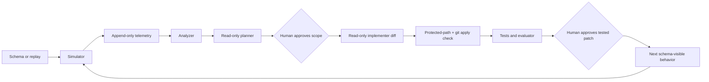

# Delivery system architecture

**Reader:** an engineer assessing whether the loop is reusable, testable, and bounded.

`dev-flywheel` turns observed API behavior into a reviewed change. It is not an autonomous deployment system and it does not replace product discovery.

## System boundary

| In the system | Outside the system |
|---|---|
| Schema-driven traffic generation | Customer authentication, tenancy, and production hosting |
| Usage telemetry and gap analysis | Product prioritization without a human decision |
| Read-only planners and diff-based handoffs | Autonomous merges or deployments |
| Tests, optional evaluator, protected-path checks | A filesystem security boundary |

## Runtime



The loop only closes when the simulator can discover the result of a shipped change from the API schema or a configured replay. A planner cannot write to the worktree; the parent orchestrator owns mutation and both human gates.

## Contracts

| Contract | Producer | Consumer | Why it exists |
|---|---|---|---|
| OpenAPI schema or replay JSONL | API / engagement | simulator | New behavior is exercised without hand-editing the simulator. |
| Usage JSONL | middleware | analyzer | Records requests, 404s, status, latency, inputs, and source metadata. |
| Signal report | analyzer | planner | Converts individual events into ranked product or integration gaps. |
| Unified diff | planner / implementer | orchestrator | Gives each mutation a reviewable, checkable handoff. |
| Evaluator JSON | independent scorer | gate 2 | Separates “HTTP worked” from domain correctness. |
| `flywheel.toml` | operator | loop | Selects the app, paths, optional evaluator, protected paths, and signal configuration. |

## Generic layer and engagement layer

| Generic layer | Engagement layer |
|---|---|
| `scripts/simulate.py` synthesizes HTTP requests from OpenAPI or replays supplied requests. | `engagements/madi_onboarding/to_replay.py` expresses partner records as `/ingest` traffic. |
| `scripts/analyze_usage.py` summarizes endpoint behavior and missing paths. | `analyze_integration.py` ranks field-level onboarding gaps. |
| `check_protected_paths.py` rejects a diff that touches configured protected paths. | The MaDI evaluator, fixtures, gold labels, matching, and fusion engines are protected. |
| Read-only subagents return artifacts; the orchestrator applies them. | Adapter and rule files are the ordinary writable extension points. |

The seam is configuration, not a fork of the loop. See [the adaptation guide](ADAPTING.md) for the required interface.

## Safety model

| Control | Mechanism | Limit |
|---|---|---|
| Mutation boundary | Read-only subagents; unified diffs; `git apply --check` | The orchestrator still relies on its configured tool permissions. |
| Evaluation boundary | Protected-path guard and Claude Code deny rules for fixtures/gold | Deny rules are not operating-system permissions. |
| Regression boundary | Evaluator compares Gate-2 output with a pre-cycle baseline | Only configured evaluator metrics are covered. |
| Human decision | Gate 1 selects scope; Gate 2 accepts the tested patch | Human review remains necessary for relevance and quality. |
| Simulator origin | URL guard rejects a cross-origin join | This is not a substitute for production network controls. |

Full threat model: [SECURITY.md](../SECURITY.md).

## Why the design is useful for applied AI delivery

The system makes four concerns explicit instead of relying on an agent prompt:

1. **Signal:** what observable failure or unmet demand justifies the work?
2. **Scope:** what can change, and who approves it?
3. **Evaluation:** what independent measure proves domain progress and detects regression?
4. **Reuse:** what configuration or abstraction converts a local solution into a repeatable capability?

The [reference engagement](../engagements/madi_onboarding/CASE_STUDY.md) exercises each concern against a held-out oracle.

## Engineering checks

```bash
uv sync --all-extras --locked
uv run pytest tests/ -q
uv run ruff check .
```

CI runs those checks on Python 3.11, 3.12, and 3.13 in one job. A second job boots the MaDI
onboarding engagement itself, replays its `forbes` fixture and ranks the resulting integration
gaps, then — with `FLYWHEEL_CONFIG` unset — re-runs the simulator against the same live app to
prove zero-domain-config discovery, checks the evaluator's regression and progression invariants,
and confirms the protected-path guard rejects plain, escaped, and symlink evaluator edits. See
[CI](../.github/workflows/ci.yml) for the executable contract.

## Non-goals

- No claim of autonomous production deployment.
- No claim that synthetic benchmark results establish customer impact.
- No generic guarantee that a protected evaluator is secure outside the documented local, single-operator model.
- No assumption that a 404 is sufficient evidence to ship a feature without human judgment.
