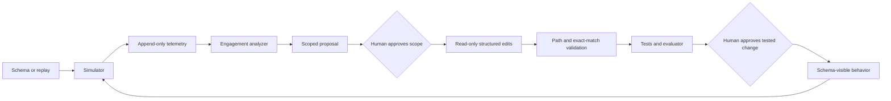

# Delivery-system architecture

**Reader:** an engineer assessing whether the loop is reusable, testable, and bounded.

`dev-flywheel` turns an observed API failure into a reviewed change. The design treats agent output as an input to a control system. It does not treat an agent as an autonomous deployer.

## The decisions behind the design

### 1. Start with a signal

A loop needs a reason to change. The simulator generates traffic from OpenAPI or a configured replay. Middleware records append-only usage events. An engagement-specific analyzer turns those events into ranked gaps.

There is no generic analyzer fallback. An integration gap has domain meaning. The MaDI analyzer understands unmapped fields, bad formats, missing required values, matching failures, and fusion conflicts. Another engagement must provide its own analyzer through `[app].analyzer`.

### 2. Give the implementer a handoff it can produce reliably

The implementer is read-only. It returns structured edits:

```json
[{"file": "path/to/file", "old_string": "exact existing text", "new_string": "replacement text"}]
```

A unified diff requires hunk counts and exact context. A read-only implementer cannot verify those details against the worktree. A structured edit removes that bookkeeping from the model’s task.

`scripts/apply_edits.py` is the single write entry point. It checks every target path, then confirms each `old_string` occurs exactly once in the current file, then writes the full submission. One bad edit rejects all edits. The orchestrator owns that mutation step.

### 3. Keep the evaluator outside the change surface

HTTP status measures transport. It does not measure domain correctness. The evaluator scores the properties that matter to an engagement: mapping, normalized values, matching, fusion, and regression.

The MaDI evaluator, gold labels, fixtures, matching engine, fusion engine, and run receipts are protected. The ordinary change surface is adapters and declarative rules.

Two boundaries, two mechanisms, because they answer different questions. What the implementer may not **write** is `[protected].paths`, checked by the protected-path guard inside the single write entry point. What it may not **read** is `[protected].unreadable`, checked by a `PreToolUse` hook declared in the implementer’s own agent definition, so it runs while that subagent is active and nowhere else. The hook walks a directory that is grepped rather than matching its name, so gold cannot be reached through a parent that matches no glob.

Agent scope matters here. The read boundary used to be a session-wide deny rule, which also blocked the orchestrator from receipts it needs to show a human at Gate 2. A boundary that stops the wrong party is a bug in the boundary, not extra safety.

This is enforced for the documented implementer. It is not a filesystem sandbox. The orchestrator and a human session can hold broader permissions. [SECURITY.md](../SECURITY.md) describes the distinction and its consequences.

### 4. Separate rapid iteration from an independent test

The synthetic MaDI fixtures are the development split. They are small, deterministic, and scored at every Gate 2. Repeated score feedback can create an overfitting channel even when the implementer cannot read the gold.

The real MaDI-Bench configuration uses separate raw data, schema gold, and `adapters_real/` write surface. It measures a mapping against a distribution whose source columns do not overlap with the synthetic source. The trial harness records evaluator invocations, so oracle use is observable.

The real-data measurement is intentionally narrow: five auto-gated runs reach the target on one low-ambiguity mapping task. It is evidence about this harness. It is not a general reliability claim.

### 5. Keep acceptance attributable

Gate 1 approves the work’s scope. Gate 2 approves the exact tested result. The system cannot merge or deploy on its own. This preserves a person’s responsibility for product relevance and acceptance risk.

### 6. Measure what the control costs

Two human gates are a throughput claim, and a throughput claim needs a number. Each cycle writes one delivery record: wall-clock per phase, human time at each gate, the outcome, resubmissions, submission size, evaluator invocations, and the metric deltas. From accumulated cycles the loop reports acceptance rate, first-pass rate, and human and wall minutes per accepted change.

A control that fires is recorded distinctly from a human declining. `regression-blocked`, `guard-rejected`, `validation-failed`, and `tests-failed` are separate outcomes from `reverted`, because collapsing them would overstate human workload and hide whether the controls do anything.

The model marks phase boundaries and nothing else. Durations, sizes, and metric deltas are derived by the recorder from files that already exist. Handing a model mechanical bookkeeping is what produced the malformed-diff failures the structured-edit contract replaced, so it is not handed any here.

Token cost is deliberately absent. The harness does not expose a reliable per-subagent token count, and an invented figure would spend the credibility the receipts earn.

## Runtime



The loop closes when the simulator can discover the result of a shipped change from the API schema or configured replay. The analyzer produces the signal. The implementer produces edits. The orchestrator performs writes and gates.

## Contracts

| Contract | Producer | Consumer | Purpose |
|---|---|---|---|
| OpenAPI schema or replay JSONL | API / engagement | simulator | Exercises current behavior without maintaining a hand-written endpoint list. |
| Usage JSONL | middleware | analyzer | Carries request shape, status, latency, inputs, source metadata, and run ID. |
| Signal report | engagement analyzer | orchestrator | Turns events into a scoped engineering decision. |
| Structured edits | implementer | `apply_edits.py` | Supplies an exact, reviewable mutation request. |
| Evaluator JSON | independent scorer | Gate 2 | Separates request success from domain progress and regression. |
| Cycle JSONL | orchestrator | `cycle_log.py report` | Records what each cycle cost and what it bought, so delivery claims are numbers. |
| `flywheel.toml` | operator | loop | Selects the app, analyzer, evaluator, paths, traffic, and protected assets. |

## Reuse boundary

The generic layer owns traffic generation, configuration loading, edit validation, gates, and common test commands. The engagement layer owns the API, telemetry interpretation, evaluator, fixtures, gold, adapters, and rules.

The seam is configuration rather than a fork. This repository exercises it with two MaDI configurations:

- `flywheel.toml` selects the synthetic development split and evaluator.
- `flywheel.real.toml` selects the separate real-data source, oracle, and adapter surface.

Two configurations against one app is weak evidence for a domain-free loop on its own; both share an API. The stronger evidence is a CI step that clears the engagement configuration entirely and runs the simulator against the live app with no domain knowledge available to it. Discovery still reaches `/ingest` and `/reconcile` from `/openapi.json` alone, and a transport-level exception fails the job. That is the generic layer working with the engagement layer switched off.

An [adaptation guide](ADAPTING.md) defines the minimum contract for another FastAPI API.

## Executable checks

```bash
uv sync --all-extras --locked
uv run pytest tests/ -q
uv run ruff check .
```

CI runs those checks on Python 3.11, 3.12, and 3.13. Its engagement job also:

- starts the MaDI API and replays the onboarding traffic;
- verifies zero-domain-config discovery reaches `/ingest` and `/reconcile`;
- fails on a transport-level simulator exception;
- checks evaluator progression and regression invariants;
- rejects protected-path edits;
- denies the implementer’s reads of gold, fixtures, and receipts, including through a parent directory, and confirms the guard is still wired into that subagent;
- records one end-to-end cycle and checks its derived economics; and
- recomputes every committed synthetic receipt and verifies recorded change hashes.

The workflow is the executable source of truth: [CI configuration](../.github/workflows/ci.yml).

## Non-goals

- Autonomous production deployment.
- A general proof that protected evaluation is secure outside the documented local workflow.
- Evidence of customer impact from synthetic benchmark metrics.
- A generic entity-resolution engine for high-volume data.
- Product prioritization without a human decision.
